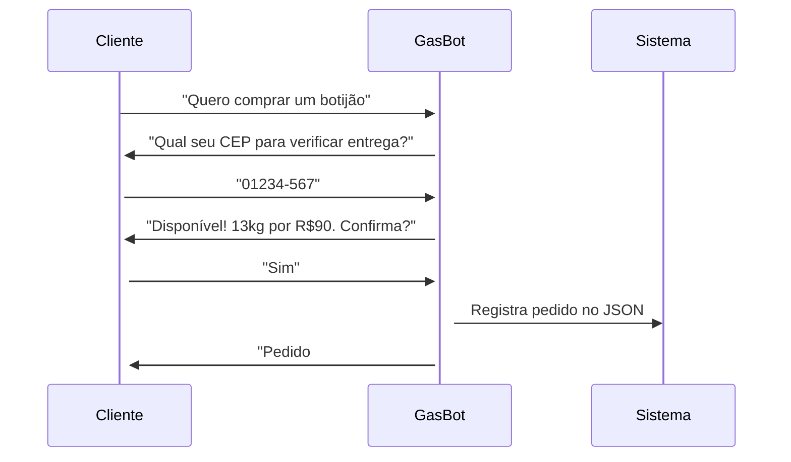

# 📦 ÓuGás - WhatsApp Bot para Venda de Botijões de Gás  

**ÓuGás** é um sistema automatizado de atendimento via WhatsApp para revendedores de gás, desenvolvido em Python com a API da Twilio.  

<div align="center">
  
  
  
</div>

## ✨ Funcionalidades  

- **Pedidos Automatizados**: Clientes solicitam botijões via mensagens no WhatsApp  
- **Banco de Dados JSON**: Armazena pedidos, clientes e histórico de vendas  
- **Respostas Inteligentes**: Reconhece intenções com processamento de linguagem natural (NLP básico)  
- **Multi-atendimento**: Gerencia vários clientes simultaneamente  

## 🛠️ Tecnologias  

| Componente       | Tecnologia          |  
|------------------|---------------------|  
| Backend          | Python 3.10+        |  
| API WhatsApp     | Twilio API          |  
| Armazenamento    | JSON                |  

## 📦 Estrutura do Projeto  

```
Whatsapp-Bot/  
├── data/  
│   ├── clients.json       # Dados dos clientes  
│   └── orders.json        # Histórico de pedidos  
├── src/  
│   ├── bot.py             # Lógica principal  
│   ├── message_handler.py # Processa mensagens  
│   └── twilio_client.py   # Configuração da API  
├── requirements.txt       # Dependências  
└── README.md              # Este arquivo  
```

## 🚀 Como Executar  

1. **Clone o repositório**:  
   ```bash
   git clone https://github.com/Biel314/Whatsapp-Bot  
   cd Whatsapp-Bot
    ```

2. **Instale as dependências**:  
   ```bash
   pip install -r requirements.txt
   ```

3. **Configure as variáveis de ambiente**:  
   Crie um arquivo `.env` dentro de `src/` com:  
   ```
   TWILIO_ACCOUNT_SID=seu_sid_twilio
   TWILIO_AUTH_TOKEN=seu_token_twilio
   TWILIO_PHONE_NUMBER=+5511999999999
   ```

4. **Execute o bot**:  
   ```bash
   python src/bot.py
   ```

## 🤖 Fluxo de Atendimento  



### ✨ Destaques Técnicos  
- **Twilio Webhooks**: Recebe mensagens em tempo real  
- **Padrão Factory**: Para criar diferentes respostas  
- **Logging**: Registro de todas as interações  

---

<div align="center">
  ✉️ Contato: <a href="mailto:gabrieldeoliveiralimasilva@gmail.com">gabrieldeoliveiralimasilva@gmail.com </a> <br> 
  🌐 Site: <a href="https://gabrielgit10110.github.io/">https://gabrielgit10110.github.io/ </a> <br>
  <br>
  ✉️ Contato: <a href="mailto:gabriel.sordonho@gmail.com">gabriel.sordonho@gmail.com </a>
   <br><br>
</div>  

**Nota**: Este projeto não é afiliado ao WhatsApp ou Twilio. Desenvolvido para fins educacionais/comerciais.  

---

## 📝 Licença  

Este projeto está sob licença MIT - veja o arquivo [LICENSE](LICENSE) para detalhes.  
